# **CSE 15L Lab Report 1**

## Step 1 - Installing VS Code

- In order to complete the first lab, you will need to have VS Code installed, if it's not already installed on your device, go to this link: [VSCode](https://code.visualstudio.com/)

- Once on the page, download the version of VS Code for your respective OS. If you're not using Windows, click the arrow next to the "Download for Windows" button to reveal options for Linux and MacOS.
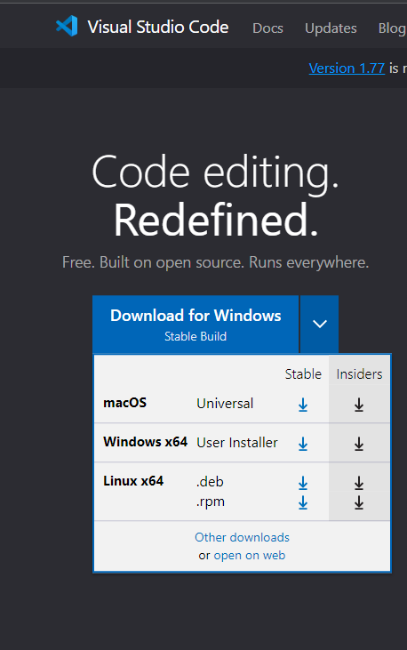

- Once you've downloaded that, run the file and open the program once it is finished installing. When it opens you should see something like this:
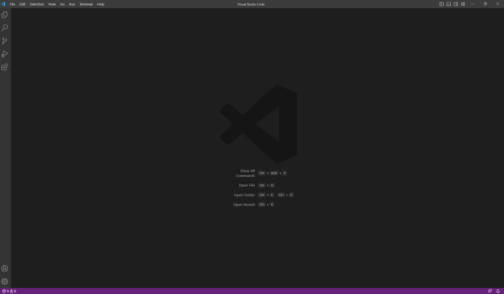

- At this point you have successfully completed the first step and are ready to move on.

## Step 2 - Obtaining your CSE 15L Account

- In order to get your CSE 15L account information, you will need to go to this link: [CSE15L](https://sdacs.ucsd.edu/~icc/index.php)

- If this is your first time logging in, under username you will put the same username you use for TritonLink and Canvas and for Student ID you will put your PID.
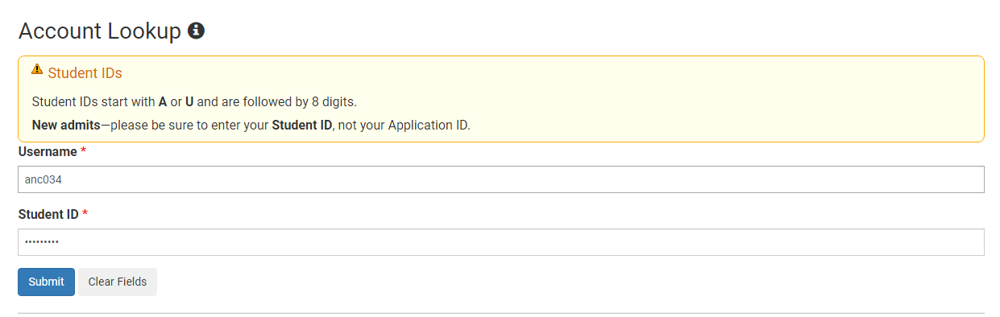

- Once you have logged in here, you will see your CSE 15L username under the "Additional Accounts" section. It will be the account name that begins with "cs15lsp23".
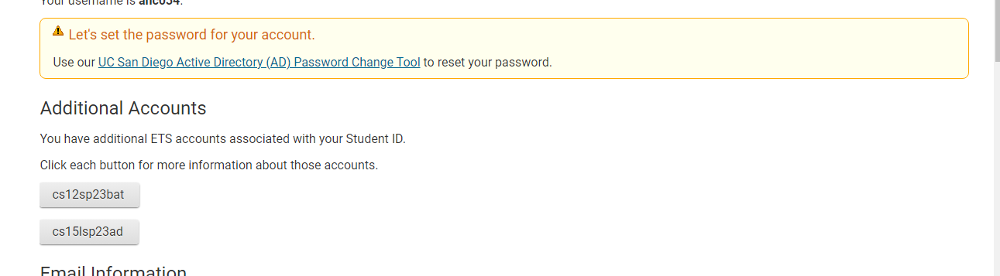

- Now that you have your username, you want to click on the password change tool above the "Additional Accounts" section to set a password for your CSE 15L account.

- Click the link as seen in the image above that takes you to the password change tool and then on the following screen select "Proceed to the Password Change Tool".

- Once you've reached the screen shown in the image below, you will want to enter your **CSE 15L Username**. After this, you will be taken to a screen where you can set the password for this account.
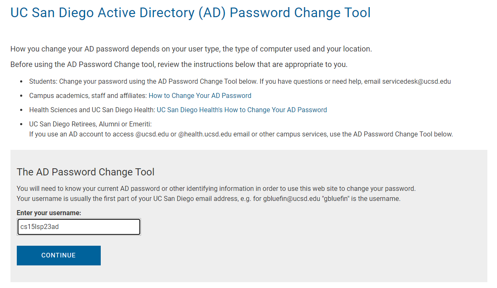

- We are now done with this step, but make sure to write down this username and password because it will be used later in the lab.

## Step 3 - Installing Git and Remotely Connecting

- For this lab we will need to use a tool called git. If you are using Windows and have not installed this on your device already, go to this link: [Git](https://gitforwindows.org/)

- Once on the page, click the blue download button and run the file. Once it is installed, close and reopen VS Code to allow any changes to take effect.
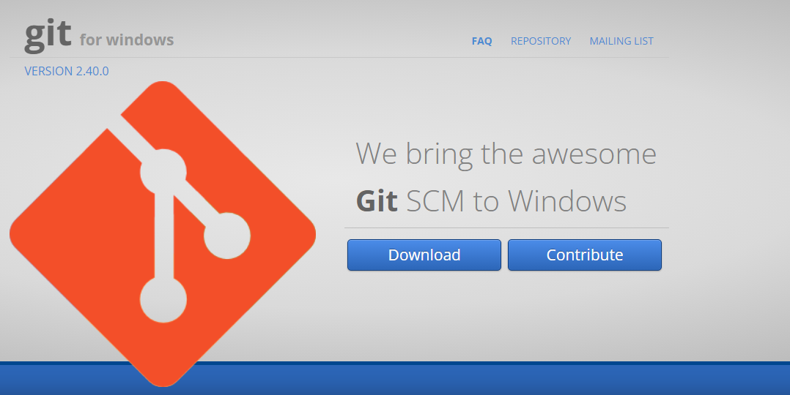

- Now that Git is installed, you want to go back to VS Code and click the "Terminal" button at the top and choose the "New Terminal" option. 
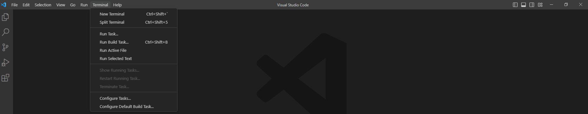

- Once the terminal is open, you will want to click the arrow that's next to the plus sign near the top right of the terminal. In this menu, you want to select the "Git Bash" option.
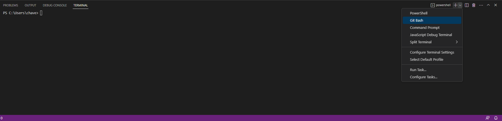

- We will now begin the process of connecting to a remote server. First, in the terminal you want to write "ssh cs15lsp23xx@ieng6.ucsd.edu" and hit enter. (**Rather than cs15lsp23xx you should write in your username that we found earlier**)
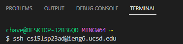

- After this you will be given a prompt in the terminal asking if you want to continue connecting since it is the first time you're connecting to this server. Type in "yes" then hit enter.

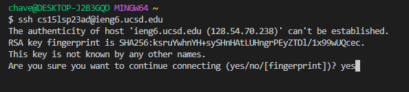

- Once you have done this, it will prompt you for a password. Type in the password that we set earlier in the lab and hit enter. If you have successfully entered your password you will see something similar to the image below. If you have incorrectly entered your password, the prompt for the password will reappear in the terminal.
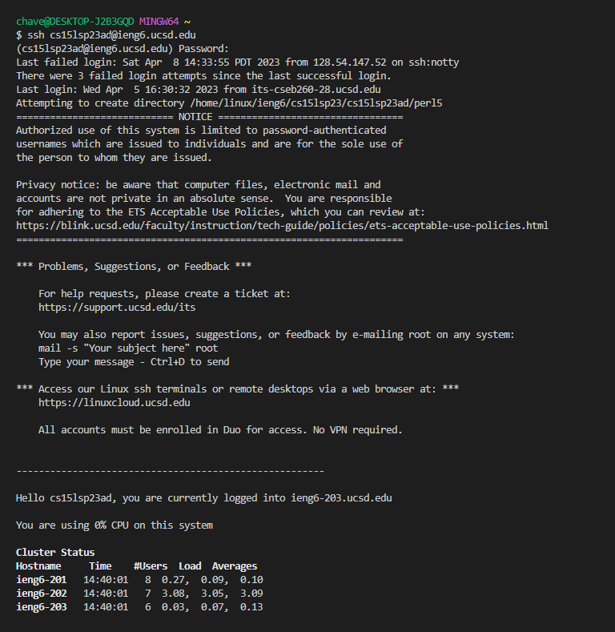

## Step 4 - Running Commands

- Now that we are logged into the remote server, we are able to try some of the commands we learned in class. For example, we are prompted to try ls, which lists the items in the given directory.

- By running the "ls" command, we see that there are only two files in the current directory, hello.txt and perl5.

- By running the "pwd" and "cd / cd ~" commands we can see that we are currently in the home directory because using cd ~ does not change our directory.

- By using some other commands we are given such as "cp" and "mkdir" we can see that these commands don't work with the given directory and throw back errors or return nothing. This could be possibly because we are not giving the right parameters or because the required files aren't present in the directory.

- By using "ls -lat" and "ls -a" we are shown other directories that contain many files.

- Finally, by using the "cat /home/linux/ieng6/cs15lsp23/public/hello.txt" command, we are able to see the contents of the hello.txt file printed out. It is worth noting that during the actual lab, this file was missing from the directory so this command returned an error. However, at the time of writing this report, the file has been added so the command runs properly

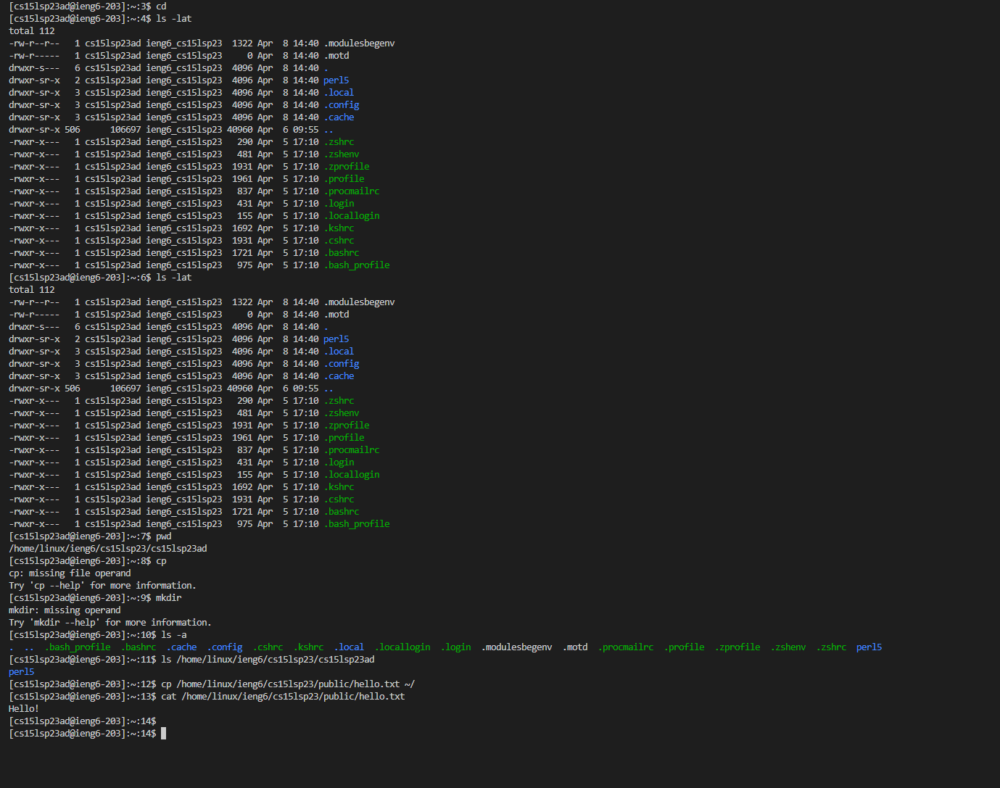
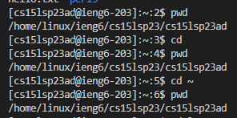 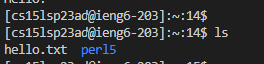

