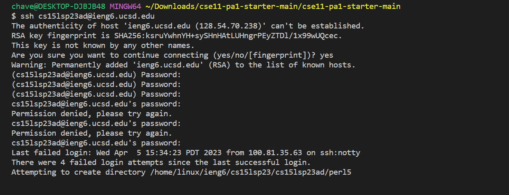
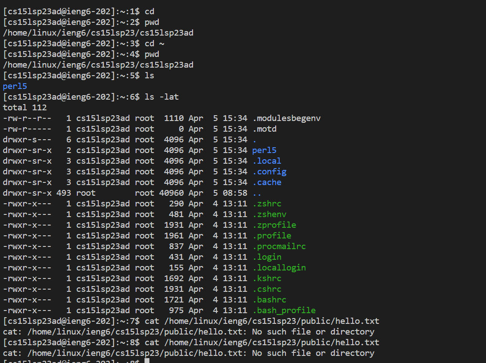

# **CSE 15L Lab Report 1**

## Step 1 - Installing VS Code

- In order to complete the first lab, you will need to have VS Code installed, if it's not already installed on the device you're using go to this link: [VSCode](https://code.visualstudio.com/)

- Once on the page, download the version of VS Code for your respective OS. If you're not using Windows, click the arrow next to the "Download for Windows" button to reveal options for Linux and MacOS.

