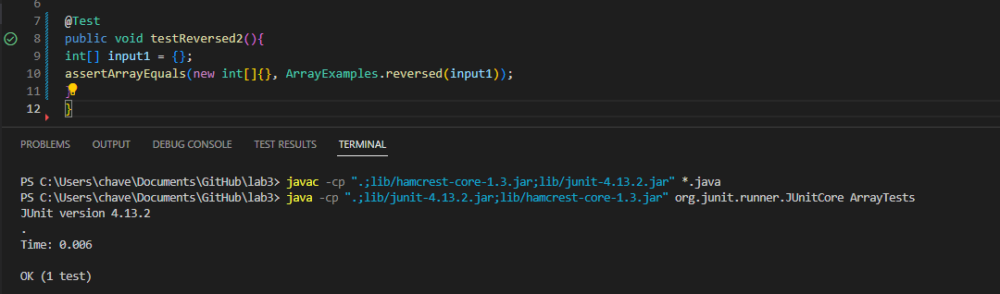

# **CSE 15L Lab Report 2**

## Part 1 - String Server


- This screenshot is showing the code for the String Server that we created and are hosing locally. The `handleRequest` method in the `SearchEngine` class deals with checking the URL that the user is inputting in their search engine. 

- The `main` method in the `StringServer` class is what allows us to use the command line to input the port number to start the server in VS Code. In the following screenshots we will see how these two methods allow the user to add strings and see the total list of strings.

  

- The first two screenshots are showing two separate instances of adding a string to the server and the third screenshot shows the terminal commands necessary to start the server.

- The first two screenshots are each calling the `handleRequest` method and are passing through their specific URL's as the parameter. For the first screenshot it would be `localhost:4123/add-message?s=Hello` and for the second screenshot it would be `localhost:4123/add-message?s=How%20are%20you` (An important note is that the URL seems to add "%20" when there is a space in the string, but those characters aren't present in the actual string as we will see later.)

- The third screenshot is calling the `main` method and we see that `4123` is being passed through as `args[0]` which is then set as the port number which we can see reflected in the URL's of the first two screenshots.

- As a result of the method calls from the first two screenshots, the else if statement in `handleRequest` is ran since `/add-message` is present in the URL. As a result of this, a String array called `parameters` is created which contains two Strings that are split from the Query of the URL at the `=`. The first string would be everything after the `?` until the `=` and the second string is everything after the `=`.

- After this, the if statement checking if `parameters[0].equals("s")` is ran and that is true in both cases as we can see from the URL and the description given above. Our method then updates `result` by adding `parameters[1]` to the end of the list. In the case of the first screenshot, this would add `"Hello"`, in the second screenshot, this would add `"How are you"`. Both of these method calls are updating the value of result by adding an additional element.


- This screenshot is showing the server printing out all of the strings we've added. An important thing to notice here is that the URL is just `localhost:4123` meaning that the path is just `/`. As a result, when the `handleRequest` method is called and the URL is passed through, the first if statement is called. 

- This if statement edits the value of `str` from just being an empty string to containing all of the strings we've previously added and stored in `result` and separating each of them with a `\n` character (This character prints each string on a new line which can be seen in the screenshot). After looping through all the values in `result` and adding them to `str`, `str` is returned and displayed on the website. 

- An important thing to note is that this URL never causes result to be edited because the else if statement is never called since the path is just `/`.

## Part 2 - Buggy Programs

- If we take the `ArrayExamples.java` file from Lab 3 and look at the `reversed` method, we will find a very glaring issue as soon as we test it. We will discuss what the specific issue is and how to fix it later, but first let's look at a test that returns a result we aren't expecting.

- If we create a JUnit Test such as this one: 
```
@Test
public void testReversed(){
  int[] input1 = {1,2};
  assertArrayEquals(new int[]{2,1}, ArrayExamples.reversed(input1));
  }
  ```
  


- We will find that the returned array is `{0,0}` rather than the expected `{1,2}`. This would imply that the code has a very clear bug since it is returning the wrong output. However, in some tests it would be possible to miss this because there are instances where the method would return the correct output.

-For example, take this JUnit Test:
```
@Test
public void testReversed2(){
int[] input1 = {};
assertArrayEquals(new int[]{}, ArrayExamples.reversed(input1));
}
```



- We will see that this test actually produces the expected output. Since `input1` was an empty array, the expected return value would simply be another empty array.

- Although this test passed, since we know that at least one test produced an incorrect input, we must look at the code for the `reversed` method and see if we can identify the bug.

- Before making any changes, the `reversed` method looked like this:
```
static int[] reversed(int[] arr) {
    int[] newArray = new int[arr.length];
    for(int i = 0; i < arr.length; i += 1) {
      arr[i] = newArray[arr.length - i - 1];
    }
    return arr;
  }
```

- By looking at this code, we can very clearly see an issue in the return statement and the for loop. First off, the method returns the original array rather than `newArray` meaning that there's already a fundamental issue in the implementation of this code. Secondly, in the for loop, the method is editing the values of `arr` rather than the values of `newArray`, but since `newArray` doesn't have any values defined, each of its values are defaulted to 0 and as a result the values of `arr` are being changed to 0 in the loop.

- This bug is relatively easy to fix as seen here:
```
static int[] reversed(int[] arr){
  int[] newArray = new int[arr.length];
  for(int i = 0; i < arr.length; i += 1){
    newArray[i] = arr[arr.length - i - 1];*
    }
  return newArray;*
```

- The lines with changed code are denoted by a `*` at the end. The main changes are that the for loop logic is fixed so that it updates the values of `newArray` starting at the end of `arr` and working its way to the front. Finally, it returns `newArray` instead of `arr`.


- As we can see by running the JUnit tests we created previously, this version of the method produces the expected result for both tests.

## Part 3 - New Knowledge

- There are two main things that I learned from the Week 2 and Week 3 labs that were interesting to me. The first thing is that I had heard about github before and how it was used to store projects and different versions of your code, but I didn't know that you could integrate it so well into editors like VS Code and how you could make changes directly from the command line by using commands like `git clone` , `git push`, `git commit` , etc. Before that lab, I thought that you had to manually add the file to the website each time you wanted to make a change so it was interesting to learn that there are more efficient ways to do that process.

- The other main thing was that I didn't know you could host a local server through the terminal in VS Code. I had known that creating a website like this was possible through outside sources, but I didn't know that you could directly code it and run it through the terminal and then access it on your device. It was also interesting to learn about how if the server is being run on a remote server, that it's possible for other people on the same network connection as the server to access that website and make changes that are visible to everyone as we saw in Lab 3. 


