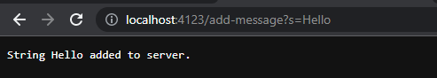

# **CSE 15L Lab Report 2**

## Part 1 - String Server

- This screenshot is showing the code for the String Server that we created and are hosing locally. The `handleRequest` method in the `SearchEngine` class deals with checking the URL that the user is inputting in their search engine. 

- The `main` method in the `StringServer` class is what allows us to use the command line to input the port number to start the server in VS Code. In the following screenshots we will see how these two methods allow the user to add strings and see the total list of strings.

 
