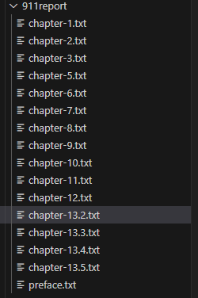

# **CSE 15L Lab Report 3**

## **Part 1 - Interesting Command Applications**

- For this lab report we'll be looking at the `find` command and looking at 4 interesting ways you can use it in the command line.
- We will see how each command is useful and what it can be used for and we will show examples by using it on files and directories from the `/technical` directory from Lab 4.

1- The first interesting usage we will look at is the `-maxdepth` modifier for the `find` command. This modifier followed by a number limits the amount of directories `find` travels through dependent on the number you provide.

- For example, `find *args* -maxdepth 2` would only travel through two directories at most.|

- Now, if we look at our `/technical` directory and run the command `find ./technical -maxdepth 1` we find the output to be this:

```
./technical
./technical/911report
./technical/biomed
./technical/government
./technical/plos
```
- However, if this command was run without the modifier such as `find ./technical` we would see that the output is very different.:

```
........
./technical/plos/pmed.0020246.txt
./technical/plos/pmed.0020247.txt
./technical/plos/pmed.0020249.txt
./technical/plos/pmed.0020257.txt
./technical/plos/pmed.0020258.txt
./technical/plos/pmed.0020268.txt
./technical/plos/pmed.0020272.txt
./technical/plos/pmed.0020273.txt
./technical/plos/pmed.0020274.txt
./technical/plos/pmed.0020275.txt
./technical/plos/pmed.0020278.txt
./technical/plos/pmed.0020281.txt
```

- For the sake of space, the ``..........`` denotes all the files preceding the ones shown in the code block, but the idea is that when there is no maximum depth, the find command finds every possible file in the given directory and the directories in that directory and so on. However when given a maximum depth with the modifier you can limit the amount of directories the command can access

- An important note about this modifier is that it **must** come before any other flags, for example you cannot do `find ./technical -name "*.txt" -maxdepth 1` instead you must format it as `find ./technica; -maxdepth 1 -name "*.txt"`.
- If formatted in the incorrect order you will receive this error:

```
find: warning: you have specified the global option -maxdepth after the argument -name, but global options are not positional, 
i.e., -maxdepth affects tests specified before it as well as those specified after it.  Please specify global options before other arguments.
```

- This can be useful if you want to reduce the amount of directories and file names you're given as shown above. It can also be useful if you specifically want to know if there's something inside of the specified directory rather than in a subfolder of that directory.

2- Another usage of the `maxdepth` modifier is that if paired with modifiers such as `-f` you can use it to know if a directory contains any files or if it only contains directories.
- For example, if we take the command from the first example:  `find ./technical -maxdepth 1`, we see that it returned a set of directories.
- However, if we were interested in learning if there were any files in this directory but didn't want to spend time reading the file names, we could run something like `find ./technical -maxdepth 1 -type f`:

```
$ find ./technical -maxdepth 1 -type f

```

- Notice that there is nothing below the command, this is because there are no files in the given directory meaning that the command will not print anything.
- By using this flag in combination with the maxdepth modifier, we have cut down the amount of time someone would need to spend looking at this to determine if there are any files or not, this could be very useful in cases where there are hundreds of directories in the given directory.

- Lastly, both of these examples were obtained from [here](https://www.redhat.com/sysadmin/linux-find-command) and I found it by searching for interesing usages for the find command on google.

3- Another usage of the `find` command can come from combining it with the `-exec` flag, this allows you to pass through other commands that run on files you have found with your `find` command.

- For example, we could run `find ./technical -name "chapter*.txt" -exec wc {} \;` would print out:

```
 731  19260 119387 ./technical/911report/chapter-1.txt
  603  6064 47910 ./technical/911report/chapter-10.txt
  817  9414 71968 ./technical/911report/chapter-11.txt
  1539  15623 129126 ./technical/911report/chapter-12.txt
 1089 10689 90943 ./technical/911report/chapter-13.1.txt
  1236  14348 111804 ./technical/911report/chapter-13.2.txt
  1718  19349 152185 ./technical/911report/chapter-13.3.txt
  2941  34343 268853 ./technical/911report/chapter-13.4.txt
  3237  37985 294230 ./technical/911report/chapter-13.5.txt
  948 10539 80751 ./technical/911report/chapter-2.txt
  3159  33834 267519 ./technical/911report/chapter-3.txt
  1204  13004 100212 ./technical/911report/chapter-5.txt
  1898  19381 150961 ./technical/911report/chapter-6.txt
  1579  17276 129949 ./technical/911report/chapter-7.txt
 1036 11324 85871 ./technical/911report/chapter-8.txt
  1885  19748 151529 ./technical/911report/chapter-9.txt
```

- There's two important things to note about the syntax of the `-exec` flag, first is that in order to pass through the files found by `find` as the parameter to the new command, we must use `{}` as the parameter to that command.
- Second, in order to end exec and run the command, we must end the line with a space followed by `\;`, without the space it will not recognize this as the end of the command.

- Using the command in this way could be useful because it allows you to save time by not having to find a file directory then run a different command on that directory manually. Additionally, it makes it easier to understand the information since everything is printed into one block rather than separated by multiple commands.

4- An additional use of the `-exec` flag is that you could pair it with the `grep` command.
- For example, if you ran `find ./technical -name "chapter*.txt" -exec grep -Hi sometimes {} \;`, you would get the output:

```
 ./technical/911report/chapter-11.txt:                and the handicap of hindsight. Hindsight can sometimes see the past clearly-with
./technical/911report/chapter-11.txt:                has often played this role, and is sometimes controversial for this very
./technical/911report/chapter-11.txt:            Government agencies also sometimes display a tendency to match capabilities to
./technical/911report/chapter-11.txt:                plot. Information was not shared, sometimes inadvertently or because of legal
./technical/911report/chapter-12.txt:                immigration and identity fraud. These can sometimes be detected.
./technical/911report/chapter-13.1.txt:                authority, sometimes successfully, but often causing friction.
./technical/911report/chapter-13.1.txt:                office" side of government operations. In the 9/11 story, for example, we sometimes
./technical/911report/chapter-13.3.txt:                administration's requests significantly, sometimes increasing programs like
./technical/911report/chapter-13.4.txt:                world, sometimes-as in Thumairy's case-with diplomatic status in the host country.
./technical/911report/chapter-2.txt:                in or traveling to the Kenya cell sometimes met. Banshiri, al Qaeda's military
./technical/911report/chapter-3.txt:                cases, but the FBI possessed the classified information sometimes needed as
./technical/911report/chapter-3.txt:                to them. Mayors in cities with large immigrant populations sometimes imposed limits
./technical/911report/chapter-3.txt:                groups sometimes cooperated. In the winter of 1999-2000, as will be detailed in
./technical/911report/chapter-3.txt:                been vested by Congress with the sometimes conflicting mandate of regulating the
./technical/911report/chapter-3.txt:            The challenge of technology, however, is a daunting one. It is expensive, sometimes
./technical/911report/chapter-3.txt:                the Clandestine Service. During the 1990s, tension sometimes arose, as it did in the
./technical/911report/chapter-3.txt:                sometimes energetic and sometimes effective. Terrorist plots were disrupted and
./technical/911report/chapter-3.txt:                Kandahar, the Taliban capital where he sometimes stayed the night, and his primary
./technical/911report/chapter-3.txt:                is sometimes controversial for this very reason. It played no role in judging the
./technical/911report/chapter-3.txt:                and theTaliban leadership were sometimes tense, but the foundation was deep and
./technical/911report/chapter-6.txt:                concerns encountered in 1998 and 1999. Although the intelligence community sometimes
./technical/911report/chapter-6.txt:                the summer of 2001 were marked by sometimes heated disagreements about ongoing
./technical/911report/chapter-7.txt:                two were aggressive, rude, and sometimes even fought with him to take over the
./technical/911report/chapter-7.txt:                Arabia that borders Yemen; this weakly policed area is sometimes called "the wild
```

- This specific command could be very helpful because it allows you to quickly pass through files and search them for lines that contain a given word, but besides that it also tells you exactly what file they came from so it's easier to find later.

- Lastly, both examples were inspired by information found in the same link as mentioned [earlier](https://www.redhat.com/sysadmin/linux-find-command).

5- Another interesting use of the `find` command is the `delete` flag.
- By using this flag at the end of the find command, it will delete all directories that are found by your given arguments. 
- For example: `find ./technical -name "chapter*.txt" -delete` deletes every file that matches that name in the given directory as seen here:

 

- This command can be very useful if you want to delete a set of files, but don't want to go in and delete each one manually. By using this command, you can make the arguments of find fit the criteria of your specified files and quickly delete them that way.

6- An important thing to note is that if you combine `delete` with other flags, you can use it to delete things besides files.
- For example, you can delete entire directories by using the `-d` flag, we can see this by running `find ./technical -name "911*" -d -delete`:


- As we saw above, the 911report directory existed, and would've been at the top of the technical directory, but it has been deleted and the biomed directory is at the top now.
- This command can be useful if the user has a large set of directories they need to get rid of and it's important because it shows you can make this command differentiate between files and directories by using these additional flags.
- An important note is that the `-delete` flag should go at the end of the `find` command and it will not print any output if the rest of your command is formatted properly and runs successfully.
- Finally, the idea to use this flag was found at [this](https://ss64.com/bash/find.html) link.

7- The last interesting use we will look at is the `-empty` flag.
- By using this flag at the end of the find command, it will find every file and directory that is empty inside of the given directory.
- For example, you could run `find ./technical -empty`:

```
find ./technical -empty

```

- Note that there is no output below the command, this means that there are no empty files in the given directory or its subdirectories. This could be useful if someone is running code that is supposed to edit or create files and they could use this to check if any of the files are empty, possibly indicating an error.
- In the case that there was a file that empty, the command would print the directory of the file or directory that is empty starting from the given directory.

8- The last example will be combining `-empty` with `delete`.
- We already know what each of these commands do individually and what they do on their own, but if combined it could be used to help someone remove files that are useless and just taking up space.
- For example, if we run `find ./technical -empty -delete` it will delete all empty files or directories as seen here (Note that for this example I addded empty files and directories to the `/technical` directory):

```
find ./technical -empty -delete

```

