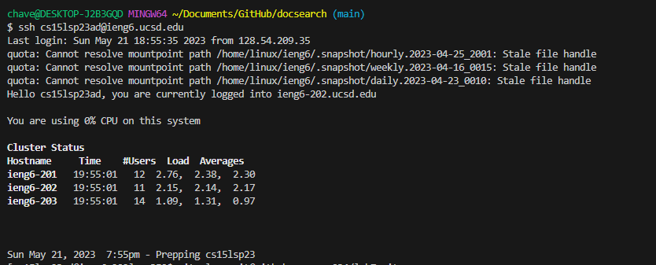
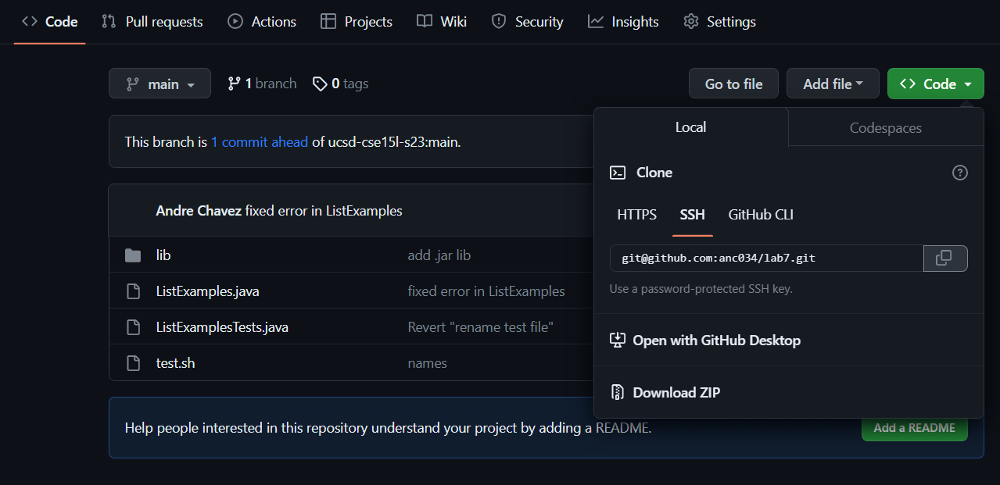
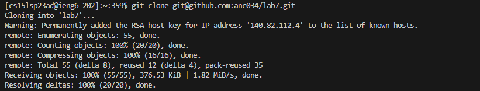
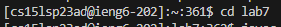
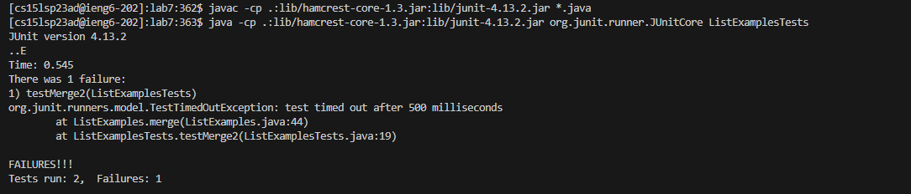
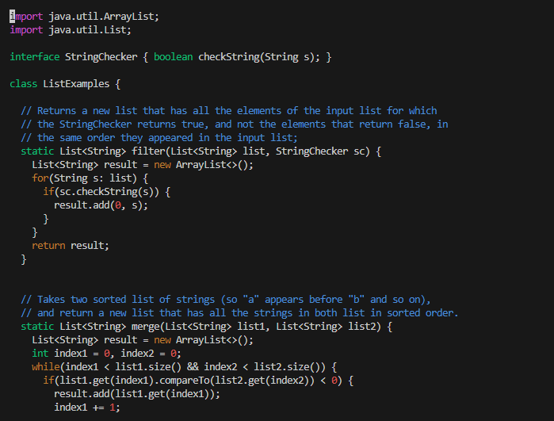
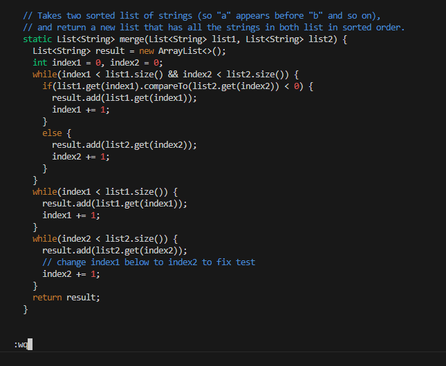
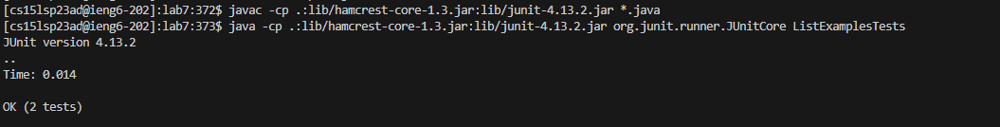

# **CSE 15L Lab Report 4**

## **Part 1 - Editing GitHub Files from the Command Line**

- The first step of this excersize from the lab is to log into our ieng6 account. To do this, we need to type `ssh cs15lsp23ad@ieng6.ucsd.edu` into the terminal (Note: "ad" can be replaced with your specific course username) and then hit `<enter>`.

- Assuming you have completed the lab setup before this exercise, this command should log you into your ieng6 account directly without any prompt for your password.

- After successfully logging into ieng6, we want to clone the lab7 github repository. To do this, we need to go to the fork we created prior to starting this exercise and we need to click the green code button near the top right, and copy the link present under the "SSH" section as seen in the image below.

- Note: If you simply copy the URL to the repository or the link under the "HTTPS" section, later steps will not work properly because the SSH key created during the setup for this exercise will not allow you to automatically push to the repository.

- After copying the SSH link that's shown above, go back to your terminal and type in the command `git clone git@github.com:anc034/lab7.git` (Note: that last part should be your respective link) and then hit `<enter>`.

- Note: For the step above, you can opt to fully type out everything, or simply type `git clone ` then right click the terminal to paste in the link you should have copied in the previous step.

- If you followed the steps correctly, this command should copy the GitHub repository into your current directory on the ieng6 machine as seen below.

- Once we've successfully cloned the repository, we want to type `cd lab7` and hit `<enter>`.

- This command will allow us to be in the correct directory for the following steps where we will need to compile and edit Java files.

- Once we are inside of the lab7 directory, we will want to compile the Java files in order to run the tests.

- We will want to run the command `javac -cp .:lib/hamcrest-core-1.3.jar:lib/junit-4.13.2.jar *.java`. We can obtain this command by going to the [Lab 7](https://ucsd-cse15l-s23.github.io/week/week7/) writeup and scrolling to the bottom. We can then highlight the correct command and type `<Ctrl-C>` after this we simply go to the terminal, right click and then type `<enter>`.

- After successfully compiling the files using the command given above, we want to run the `java -cp .:lib/hamcrest-core-1.3.jar:lib/junit-4.13.2.jar org.junit.runner.JUnitCore ListExamplesTests` command. We can obtain this command by going to the same lab writeup as mentioned above and copying the command found at the bottom up until the "..." by highlighting it and typing `<Ctrl-C>`. After this, we will go to the terminal, right click, then type `ListExamplesTests` at the end as shown above and lastly type `<enter>`.

- If you followed these steps correctly, the Java files will have compiled and will run the tests showing if there are any failures in the terminal as seen below.

- Now that we've run the tests and noted that some tests failed, we want to edit the file and fix them.

- To do this, we want to type the `vim ListExamples.java` command and type `<enter>`.

- To fix the error you will need to make the following inputs: `<4> <3> <j> <1> <1> <l> <x> <i> <2> <esc> <:> <w> <q> <enter>`

- If you did these steps in the correct order, they would have directed you to the correct line in the Java file that was opened in vim and then would've made the correct edit to fix the code. Lastly, it would've saved the changes and exited vim.

- To confirm that we did this correctly, we can recompile and rerun the Java files from earlier to test that our changes were saved and worked properly.

- There are two ways to do this, we can simply repeat the earlier steps where we copied the commands from the lab writeup and pasted them into the terminal or we can use `<Ctrl-R>`.

- If we opt to use the second method, type `<Ctrl-R>` in the terminal, then type `javac` and type `<enter>`. After this type `java` and press `<space>` then type `<enter>`.

- Using either of the two methods, this should rerun the tests we ran earlier and should show that both tests ran successfully and there are no errors.

