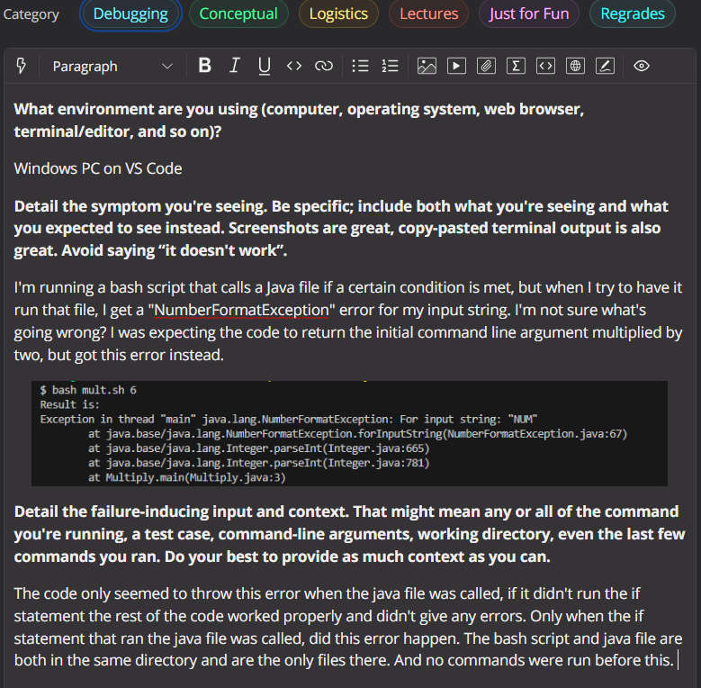
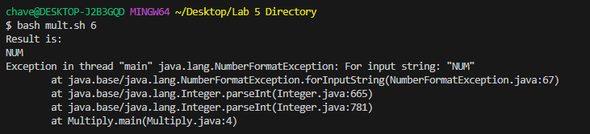
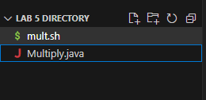
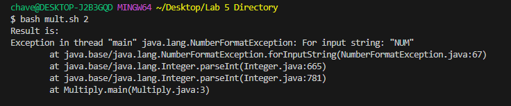

# **CSE 15L Lab Report 5**

## **Part 1 - Debugging Scenario**

### **Step 1: Viewing the EdStem Post**

- For this lab report we will be running through a debugging scenario similar to those from [Lab 9](https://ucsd-cse15l-s23.github.io/week/week9/).

- To begin we need to look at the EdStem post made by the student who is having issues with their code in order to start figuring out what the possible issue is and how we can help.

- Based on this post, we have a starting point for debugging the code since we know the error being thrown is a `NumberFormatException` and we're told that the code only throws an error when the if statement is called so we can assume the bug is somewhere in that section of the code.

- Based on the knowledge from this post, we can move to the next step.

### **Step 2: Suggesting Commands for Debugging**

- In this step, we are acting as the TA for this student and will give advice so they can definitively identify the bug based on the EdStem post shown above.

- Based on the post, we can see that the error occurs at line 3 in the Multiply.java file. As a result, my suggestion to the student would be to create a print statement using `System.out.println` and place it on the line directly before the code that's currently on line 3. I would advise them to print the variable that is being parsed so that we can identify if it is correct or if it is the source of the bug. (Note: We know the error comes from `Integer.parseInt` on line 3 by looking at the EdStem post that shows the trace for the error.)

- After they do this, I would tell the student to rerun the original error-producing command to see what the print statement tells them about their parameter right before the error is caused. 

- We are given this screenshot by the student after following the advice given above:

- Based on this, we can clearly see that the issue causing the error is the value being passed through to the Java file. The print statement placed in the java file tells us that the value passed to the `Integer.parseInt` method, is currently just `"NUM"`. This causes an issue because we obviously cannot parse a String. 

- However, based on the EdStem writeup, the student was expecting the number given in the command line argument to be passed through to the Java file in this case. Clearly this means that there is an issue with the parameter they are passing through when calling the `java Multiply` command inside of their bash script. 

- Due to this, I would advise the student to check if when refferring to a variable in their bash script they are including the required `$` before the variable name because otherwise it will pass it through as just a string and cause the error seen here.

### **Step 3: File Setup and Fixing the Bug**

- In order to recreate the environment in which this bug occurred you simply need a directory that contains the `Multiply.java` file and the `mult.sh` bash script. No other files should exist in the directory and there are no sub-directories.

- The contents of the bash script prior to fixing the error are shown below:

~~~
NUM=$1

MOD=$NUM%2

javac Multiply.java

if [[ $MOD -eq 0 ]]
then
    echo "Result is: " 
    java Multiply NUM
else
    echo $NUM
fi
~~~

- The contents of the Java file prior to fixing the error are shown below:

~~~
class Multiply{
    public static void main(String[] args){
        System.out.println(args[0]);
        System.out.println(Integer.parseInt(args[0])* 2);
    }
}
~~~

- To trigger the bug, simply run the `bash mult.sh x` command with `x` being any number evenly divisible by 2, For example: you could run `bash mult.sh 2` to produce the error.

- In order to fix the bug, you need to edit the code on line 10 of the bash script to include the `$` prior to the `NUM` variable name in the `java Multiply` call of the bash script as shown below:

~~~
NUM=$1

MOD=$NUM%2

javac Multiply.java

if [[ $MOD -eq 0 ]]
then
    echo "Result is: " 
    java Multiply $NUM   #This Line
else
    echo $NUM
fi
~~~
- Note: A comment has been placed on the line with the edit made to fix the bug, the comment is the text that says `#This Line`.

- Note: No changes are required to the Java file to fix this bug, but if you followed the debugging steps from above, you may want to remove the `System.out.println` method call to get rid of unneccessary print statements.

## **Part 2 - Reflection**

- I think that the main thing I learned from the labs in the second half of this quarter that I found interesting was the creation of SSH keys. I don't think I had heard of them before learning about them during lab and honestly throughout the quarter I was getting annoyed of having to manually log into ieng6 every time so it was really fun to learn there was a more efficient way to go about it. Additionally, it was nice to have the concept of SSH keys connect to how you can use resources like GitHub directly from the terminal because prior to the labs that covered this, I knew that it was possible, but I didn't really know how it worked because every time I had tried I would just receive some error and I wasn't sure how to proceed from that point. Overall, I just thought it was a really cool concept because it connected to a lot of things we had learned earlier in the quarter and it was fun to learn how to make my own SSH keys which I'm sure will be useful at some point in the future.

